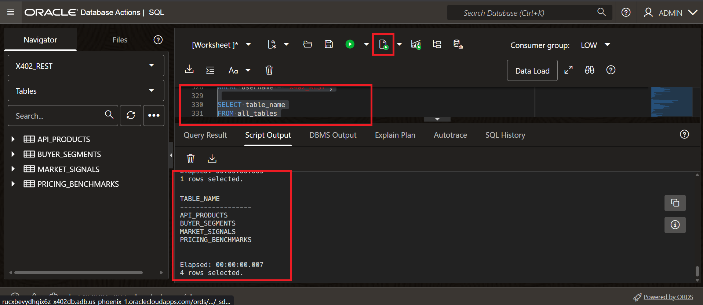

# Lab 2: Create a Market Intelligence API with ORDS AutoREST

## Introduction

ORDS AutoREST exposes database tables and views as REST endpoints. In this lab, you create a realistic paid data product for AI agents. The API serves market signals, API product metadata, buyer segments, and pricing benchmarks. The dataset lives in a workshop-owned schema named `X402_REST`, so it avoids maintained-schema restrictions.

### Objectives

- Create the `X402_REST` schema for workshop REST access.
- Seed realistic market intelligence data for agent-facing API monetization.
- AutoREST-enable the signals, products, segments, and pricing endpoints.
- Verify the generated ORDS endpoint and save its base URL.

Estimated Time: 8 minutes

## Task 1: Download the Market API SQL Helper

1. In Cloud Shell, return to your workshop directory:

    ```
    <copy>
    cd ~/x402-workshop
    source workshop.env
    source workshop-outputs.env
    </copy>
    ```

2. Download the helper SQL:

    ```
    <copy>
    curl -fsSLO "$WORKSHOP_FILES_BASE/02-enable-ords-autorest/files/setup-market-autorest.sql"
    </copy>
    ```

3. Replace the schema-password placeholder from `workshop.env`:

    ```
    <copy>
    python3 - <<'PY'
    import os
    from pathlib import Path

    password = os.environ.get("REST_SCHEMA_PASSWORD") or os.environ.get("SH_PASSWORD")
    if not password:
        raise SystemExit("Set REST_SCHEMA_PASSWORD in workshop.env, then rerun this command.")

    path = Path("setup-market-autorest.sql")
    path.write_text(path.read_text().replace("ReplaceWithStrongRestPassword#2026", password))
    PY
    </copy>
    ```

    The fallback to `SH_PASSWORD` supports older `workshop.env` files created before the market dataset update.

## Task 2: Run the SQL in Database Actions

1. In the OCI Console, open your `x402-monetized-db` Autonomous Database.
2. Click **Database actions** > **SQL** and sign in as `ADMIN`.
3. Paste and run the contents of `setup-market-autorest.sql`.
4. Confirm the final queries return:

    - `X402_REST` with `OPEN` account status.
    - Four tables owned by `X402_REST`: `API_PRODUCTS`, `BUYER_SEGMENTS`, `MARKET_SIGNALS`, and `PRICING_BENCHMARKS`.

    

The SQL helper maps ORDS to `/ords/market/` and exposes these endpoints:

- `/ords/market/signals/`
- `/ords/market/products/`
- `/ords/market/segments/`
- `/ords/market/pricing/`

The helper is safe to rerun. If an earlier attempt enabled `X402_REST` with another ORDS base path, the script disables that mapping before enabling `/ords/market/`.

## Task 3: Verify the ORDS Endpoint

1. In Database Actions, keep the browser tab open and copy the host from the address bar. Keep only the protocol and host through `oraclecloudapps.com`.

    The `ADMIN` REST overview can show `0` AutoREST objects. That is expected because the page is scoped to the signed-in schema. The market endpoints belong to `X402_REST`, so verify them directly by URL.

2. In Cloud Shell, save the host value:

    ```
    <copy>
    export ADB_ORDS_HOST="https://YOUR-ADB-HOST.adb.YOUR-REGION.oraclecloudapps.com"
    </copy>
    ```

3. Download and run the ORDS verifier:

    ```
    <copy>
    curl -fsSLO "$WORKSHOP_FILES_BASE/02-enable-ords-autorest/files/verify-market-ords.sh"
    chmod +x verify-market-ords.sh
    ./verify-market-ords.sh
    </copy>
    ```

4. Confirm the verifier prints `Canonical market endpoint is ready`.

    If the verifier prints `HTTP status: 404`, the market tables were created but ORDS did not publish the canonical `/ords/market/signals/` path. Re-download `setup-market-autorest.sql`, replace the password placeholder again, run it as `ADMIN`, and then rerun the verifier. This usually means an older SQL helper was run or a previous ORDS mapping stayed enabled.

5. Test the `signals` endpoint directly:

    ```
    <copy>
    curl "$ADB_ORDS_HOST/ords/market/signals/?limit=5"
    </copy>
    ```

6. Confirm the response includes an `items` array with market signal records.

7. Save the ORDS base URLs in `workshop.env`:

    ```
    <copy>
    cat ords-market.env >> workshop.env
    source workshop.env
    </copy>
    ```

8. Confirm the saved values:

    ```
    <copy>
    grep -E 'UPSTREAM_BASE|ORDS_RECEIPTS_URL' workshop.env
    </copy>
    ```

## Learn more

- [Oracle REST Data Services documentation](https://docs.oracle.com/en/database/oracle/oracle-rest-data-services/)
- [ORDS Developer Guide: Developing REST applications](https://docs.oracle.com/en/database/oracle/oracle-rest-data-services/24.4/orddg/developing-REST-applications.html)
- [ORDS Developer Guide: AutoREST](https://docs.oracle.com/en/database/oracle/oracle-rest-data-services/24.4/orddg/developing-REST-applications.html)
- [SQL Developer Web: AutoREST page](https://docs.oracle.com/en/database/oracle/sql-developer-web/sdwad/autorest-page.html)
- [Oracle Autonomous AI Database documentation](https://docs.oracle.com/en/cloud/paas/autonomous-database/index.html)

## Acknowledgements

- **Author** - Nicholas Cusato, Senior Cloud Engineer
- **Last Updated** - June 2026
- **References** - x402 specification, Coinbase x402 documentation, OCI API Gateway documentation, OCI Functions documentation, ORDS AutoREST documentation
