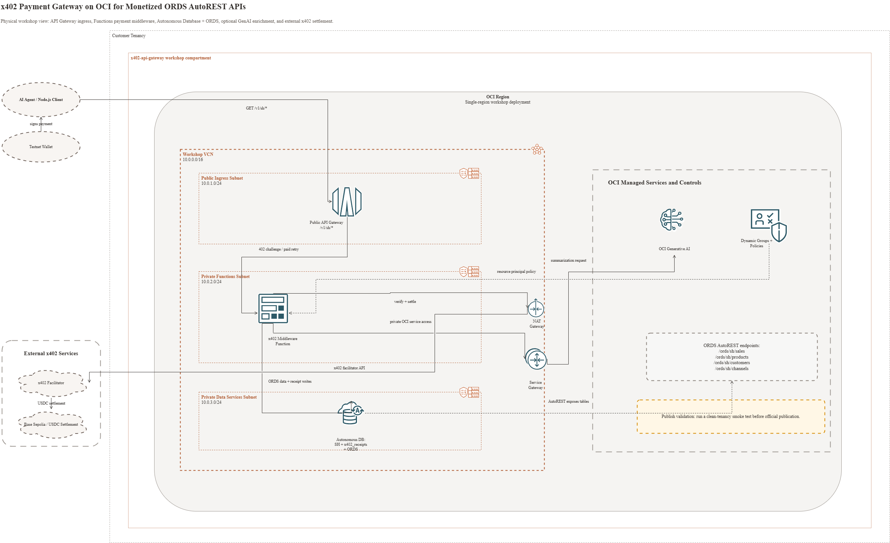

# Introduction

## Introduction

In this workshop, you will build a production-ready x402 payment gateway on Oracle Cloud Infrastructure that monetizes a real database API. You will take the **SH (Sales History)** sample schema that ships pre-loaded in every Autonomous Database, expose it as REST endpoints using ORDS AutoREST, and put it behind an x402 payment gate - turning your database into a per-call monetized data product in minutes.

x402 is an open, HTTP-native payment standard that enables APIs to charge for access per-request, without API keys, subscriptions, or account creation. Settlement happens directly on blockchain using stablecoins.

By the end of this workshop, you will have:
- A REST API auto-generated from the SH schema using ORDS AutoREST
- An x402 payment gateway deployed on OCI API Gateway that protects the API
- An OCI Function backend that returns the 402 challenge, validates payment signatures, settles transactions, and fetches the paid ORDS response
- A test client (AI agent simulation) that pays per query
- Idempotency and receipt tracking inside the same Autonomous Database
- (Optional) OCI Generative AI summarization that turns raw rows into agent-ready insights

This pattern - database table -> REST endpoint -> monetized x402 API -> AI-polished response - is the fastest path from "I have data" to "agents pay me for answers."

**Estimated Workshop Time:** 90 minutes (110 with optional Gen AI lab)

### Objectives

- Enable ORDS AutoREST on the pre-loaded SH (Sales History) schema in ADB
- Generate REST endpoints for SH tables and views without writing code
- Provision OCI API Gateway and Functions on the Always Free tier
- Deploy x402 middleware as an OCI Function
- Wire the gateway to charge per database query
- Test end-to-end with a Node.js agent client
- Persist payment receipts in the same ADB instance
- Optionally enrich responses with OCI Generative AI

### Prerequisites

- An Oracle Cloud Account (Free Tier eligible)
- Basic familiarity with REST APIs, HTTP status codes, and SQL
- Node.js 18+ installed locally
- A text editor or IDE

## Architecture

The request path starts with an AI agent or Node.js client calling OCI API Gateway. API Gateway invokes the x402 middleware function. The function returns the 402 challenge, verifies and settles the payment, writes receipts to Autonomous Database, fetches ORDS AutoREST data from the SH schema, and can optionally call OCI Generative AI before returning the paid response.

## Labs

1. **Lab 1:** Provision OCI Infrastructure (10 minutes)
2. **Lab 2:** Enable ORDS AutoREST on the SH Schema (15 minutes)
3. **Lab 3:** Deploy x402 Middleware as an OCI Function (20 minutes)
4. **Lab 4:** Integrate x402 with API Gateway and the SH REST API (15 minutes)
5. **Lab 5:** Test With an Agent Client (15 minutes)
6. **Lab 6:** Add Idempotency and Payment Receipts (15 minutes)
7. **Lab 7 (Optional):** Polish Responses With OCI Generative AI (20 minutes)
8. **Lab 8:** Troubleshooting and Next Steps

---

## Learn More

- [Oracle Autonomous Database documentation](https://docs.oracle.com/en/cloud/paas/autonomous-database/index.html)
- [Oracle REST Data Services documentation](https://docs.oracle.com/en/database/oracle/oracle-rest-data-services/)
- [OCI API Gateway documentation](https://docs.oracle.com/en-us/iaas/Content/APIGateway/home.htm)
- [OCI Functions documentation](https://docs.oracle.com/en-us/iaas/Content/Functions/home.htm)

## Acknowledgements

- **Author** - Nicholas Cusato, Senior Cloud Engineer
- **Last Updated** - June 2026
- **References** - x402 specification, Coinbase x402 documentation, OCI API Gateway documentation, OCI Functions documentation, ORDS AutoREST documentation
